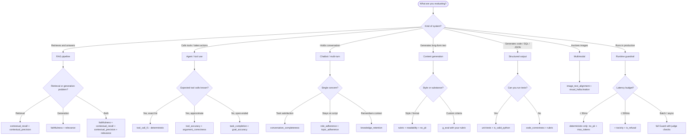

# Choosing metrics

checkllm ships with ~70 LLM-as-judge metrics and ~40 deterministic checks.
The number is a feature, not a trap: most scenarios need only 3-5 of them.
This page helps you pick the right ones fast.

!!! abstract "The one rule"
    **Start with deterministic checks. Add one judge metric per concern.
    Stop.** Most production setups need 2-4 deterministic guards and 2-3
    judge metrics. If you are reaching for a seventh metric, you are probably
    measuring the same thing twice.

## TL;DR: pick by use case

| Use case                | Essential                                                                                  | Nice to have                                                                 | Avoid / skip                                                              |
|-------------------------|--------------------------------------------------------------------------------------------|------------------------------------------------------------------------------|---------------------------------------------------------------------------|
| **RAG**                 | `faithfulness`, `contextual_recall`, `contextual_precision`, `relevance`                   | `context_entity_recall`, `noise_sensitivity`, `citation_accuracy`            | `fluency`, `coherence` (rarely the problem)                               |
| **Agents / tool use**   | `tool_call_f1`, `tool_accuracy`, `task_completion`                                         | `plan_adherence`, `argument_correctness`, `trajectory_step_count`            | `bias`, `toxicity` (usually out of scope)                                 |
| **Chatbot / multi-turn**| `conversation_completeness`, `role_adherence`, `knowledge_retention`                       | `turn_relevancy`, `topic_adherence`                                          | `correctness` (no ground truth per turn)                                  |
| **Content generation**  | `rubric` or `g_eval`, `instruction_following`                                              | `fluency`, `coherence`, `no_pii`, `readability`                              | `faithfulness` (no context)                                               |
| **Code generation**     | `code_correctness`, `is_valid_python`/`is_valid_sql`, functional tests                     | `rubric` for style, `sql_equivalence` for SQL                                | `fluency`, `coherence`                                                    |
| **Image / multimodal**  | `image_text_alignment`, `multimodal_faithfulness`, `visual_hallucination`                  | `ocr_accuracy`, `chart_value_extraction`                                     | Text-only metrics                                                         |
| **Production guardrail**| `no_pii`, `max_tokens`, `toxicity`, `is_refusal`                                           | `misuse_detection`, `role_violation`, `non_advice`                           | Heavy judge metrics (latency)                                             |
| **Safety review**       | `toxicity`, `bias`, `pii_detection`, `misuse_detection`                                    | `role_violation`, `non_advice`                                               | n/a                                                                       |
| **Red team**            | `RedTeamer` + `toxicity`, `pii_detection`, `is_refusal`                                    | `redteam_evolver` for novel attacks                                          | Quality metrics                                                           |
| **Compliance**          | `ComplianceScanner`, `pii_detection`, `non_advice`                                         | Framework-specific vulnerabilities (HIPAA, GDPR, PCI-DSS, SOX)               | Generic quality metrics                                                   |

## Decision flowchart

## Category deep dives

### RAG and grounding

**What it measures.** Whether retrieval returned the right context and whether
generation actually used it.

**When to use.** Any application that calls `retrieve()` then `generate()` -
knowledge-base bots, doc-Q&A, summarisers over fetched text.

**Key metrics.**

- **`faithfulness`** - the one non-negotiable metric for RAG. Answers the
  question "does every claim trace back to context?". Threshold 0.85+.
- **`contextual_recall`** - retrieval did its job; the relevant chunks are in
  the context window. Needs a gold answer.
- **`contextual_precision`** - relevant chunks are ranked ahead of noise.
  Needs gold relevance labels or a query+answer pair.
- **`relevance`** - generated answer addresses the original query (distinct
  from grounding: an answer can be faithful but off-topic).
- **`context_entity_recall`** - for entity-heavy questions where missing a
  single name means the answer is wrong.
- **`noise_sensitivity`** - deliberately injects irrelevant chunks to see if
  the model gets distracted.
- **`citation_accuracy`** - if your UI shows `[1]`, `[2]` markers, verify the
  marker points at the right chunk.

**Common pitfalls.**

- Running only `faithfulness`: an unfaithful-but-retrieval-was-empty answer
  still passes. Pair with `contextual_recall`.
- Running `relevance` without `faithfulness`: a confident hallucination is
  on-topic and relevant.
- Using `fluency` to check RAG quality: RAG answers are almost always fluent;
  the bug is always grounding.

---

### Agents and tool use

**What it measures.** Whether an agent picked the right tools, called them
with correct arguments, and in a reasonable sequence.

**When to use.** ReAct agents, MCP clients, function-calling pipelines,
LangGraph / CrewAI / custom orchestrators.

**Key metrics.**

- **`tool_call_f1`** - deterministic F1 over tool names. Free, instant.
  Always run it first when you have an expected tool list.
- **`tool_accuracy`** - judge-based: was the *right* tool chosen for the
  query? Use when F1 is too strict (e.g., synonym tools, optional calls).
- **`argument_correctness`** - semantic check on arguments. Catches
  `search("capital france")` vs `search("capital of France")`.
- **`plan_adherence`** - if your agent emits a plan, verify the execution
  trace follows it.
- **`task_completion` / `goal_accuracy`** - did the agent finish the job,
  regardless of how?
- **`trajectory_step_count`** - catches loops and over-thinking.

**Common pitfalls.**

- Only checking `task_completion`: a successful task with a bloated 40-step
  trajectory still passes. Pair with `trajectory_step_count`.
- Ignoring `argument_correctness`: right tool, wrong arguments = silently
  broken.
- Using judge metrics on trivially-checkable tool sequences: start with
  `tool_call_f1` and only add judges for the fuzzy parts.

---

### Conversation and multi-turn

**What it measures.** How the assistant performs over a full transcript,
not just a single turn.

**When to use.** Customer-support bots, therapy/coaching flows, any session
where state matters across turns.

**Key metrics.**

- **`conversation_completeness`** - every user request was ultimately
  satisfied.
- **`role_adherence`** - the assistant did not break character / scope.
- **`knowledge_retention`** - information from turn 2 is still correct at
  turn 6.
- **`topic_adherence`** - conversation stayed within allowed topics (useful
  for narrow-scope bots like banking assistants).
- **Per-turn** `turn_relevancy` / `turn_faithfulness` / `turn_coherence` -
  granular signals when you need to find *which* turn broke.

**Common pitfalls.**

- Running per-turn metrics without holistic ones: every turn can pass while
  the overall conversation fails the user.
- Measuring `correctness` per turn: there is rarely a canonical per-turn
  ground truth.

---

### Content generation

**What it measures.** Subjective quality of open-ended text - summaries,
marketing copy, explanations.

**When to use.** No reference output exists, only a rubric or style guide.

**Key metrics.**

- **`rubric`** - free-form criteria you write as plain English.
- **`g_eval`** - G-Eval chain-of-thought variant; more stable scores on
  fuzzy criteria.
- **`instruction_following`** - honours explicit instructions ("in 50 words,
  no lists, formal tone").
- **`fluency` / `coherence`** - cheap sanity checks.
- **`readability`** - deterministic grade-level check; great for copy aimed
  at non-expert readers.

**Common pitfalls.**

- Running every quality metric at once: `fluency`, `coherence`,
  `consistency`, `rubric` all overlap. Pick one per axis.
- Ignoring `instruction_following`: LLMs often drop an instruction silently.

---

### Code generation

**What it measures.** Whether generated code parses, runs, and does the
right thing.

**When to use.** SQL generators, Python/TypeScript assistants, code-review
tools.

**Key metrics.**

- Run the code. Nothing else is close. Use `is_valid_python` /
  `is_valid_sql` as a cheap gate, then actually execute against tests.
- **`code_correctness`** - judge metric for when tests are impractical
  (e.g., DSLs, infrastructure code).
- **`sql_equivalence`** - judge-based logical equivalence for SQL.
- **`rubric`** - style, readability, idiom checks.

**Common pitfalls.**

- Using judge metrics instead of execution. A model that says "looks good"
  is not a compiler.
- Ignoring validity checks: `is_valid_python` catches 40% of bugs for free.

---

### Multimodal

**What it measures.** Text responses grounded in images (or vice versa).

**When to use.** Vision-language models, OCR pipelines, chart QA,
diagram comprehension.

**Key metrics.**

- **`image_text_alignment`** - baseline "does the text describe the image".
- **`multimodal_faithfulness`** / **`visual_faithfulness`** - claims in text
  supported by image.
- **`visual_hallucination`** - catches fabricated visual details.
- **`ocr_accuracy`** - pure OCR pipelines.
- **`chart_value_extraction`** - quantitative chart-QA.

**Common pitfalls.**

- Using text-only faithfulness on multimodal outputs: it will pass as long
  as the output is internally consistent.

---

### Production guardrails

**What it measures.** Runtime safety and cost/latency bounds *before* an
output reaches the user.

**When to use.** Every production LLM endpoint. No exceptions.

**Key metrics.**

- **Always:** `no_pii`, `max_tokens`, `is_refusal` (catches jailbreak
  tells), `toxicity` (judge or a cheap classifier).
- **If you have latency budget:** add `misuse_detection`, `role_violation`,
  `non_advice`.
- **Structured output:** `json_schema` with a Pydantic model.

**Common pitfalls.**

- Blocking on heavy judge metrics in the hot path: run them async, log
  failures, decide asynchronously whether to retract.
- Not pairing regex `no_pii` with judge-based `pii_detection`: regex misses
  names, addresses, medical identifiers.
- Raising on every failure: use `soft=True` for observability-only checks.

---

### Safety review

**What it measures.** Pre-launch sweep for harmful behaviour across a
corpus.

**When to use.** Before shipping a new model, system prompt, or RAG
corpus.

**Key metrics.** `toxicity`, `bias`, `pii_detection`, `misuse_detection`,
optionally `role_violation` and `non_advice` for regulated domains.

**Common pitfalls.**

- Evaluating on synthetic prompts only. Pair with a sampled production log.
- Binary "did any fail?" summary. Look at severity distributions.

---

### Red team

**What it measures.** Resistance to adversarial input - prompt injection,
jailbreaks, PII exfiltration, role escape.

**When to use.** At least once per major release; ideally in CI.

**Key tools.**

- `checkllm.redteam.RedTeamer` - orchestrates attack generation and
  scoring.
- `VulnerabilityType` - ~150 attack categories mapped to OWASP LLM Top-10
  and compliance frameworks.
- `AdversarialAttackEvolver` - evolves new attacks when known ones stop
  working.

**Common pitfalls.**

- Running only `PROMPT_INJECTION`: the interesting failures are usually in
  `INDIRECT_PROMPT_INJECTION`, `DATA_EXFILTRATION`, and
  `CONTEXT_POISONING`.
- Reporting vulnerability rates without severity weighting.

---

### Compliance

**What it measures.** Domain-specific regulated behaviour - HIPAA, GDPR,
PCI-DSS, SOX, FERPA, and friends.

**When to use.** Healthcare, finance, ed-tech, any regulated vertical.

**Key tools.**

- `checkllm.compliance_frameworks.ComplianceScanner` - runs the mapped
  vulnerability set against a target.
- `RedTeamer.scan_compliance(preset=CompliancePreset.HIPAA)` - tailored
  scans.
- `non_advice` metric - enforces "not professional advice" disclaimers
  in regulated verticals.

**Common pitfalls.**

- Treating compliance output as a pass/fail gate. Most frameworks need
  human sign-off; checkllm produces the evidence, not the verdict.

## Deterministic vs LLM-judge: when each wins

| Dimension              | Deterministic                                   | LLM judge                                        |
|------------------------|-------------------------------------------------|--------------------------------------------------|
| **Latency**            | Microseconds                                    | 0.5-5s per call                                  |
| **Cost**               | Zero                                            | $0.0001 - $0.01 per call                         |
| **Stability**          | Identical every run                             | Variance ~5-15% even with temperature=0          |
| **Accuracy ceiling**   | Only catches what you explicitly pattern-match  | Can catch semantic issues you did not pre-specify |
| **Debuggability**      | Trivial - the pattern is the spec               | Reasoning field helps, but opaque in aggregate   |
| **Best for**           | Format, size, presence/absence, budgets         | Grounding, intent, style, subjective quality     |
| **Worst for**          | Anything requiring judgement                    | Anything trivially verifiable                    |

**Rule of thumb.**

1. Write the deterministic checks first. They are free.
2. Add a judge metric per remaining concern.
3. If a judge metric could be replaced by a deterministic check, replace it.
   A regex is more reliable than an LLM for "output starts with `{`".
4. Cap judge metrics at ~5 per test. Beyond that, latency and variance swamp
   the signal.
5. In production, run deterministic checks synchronously and judge checks
   asynchronously. Log failures; retract only on critical deterministic
   failures.

!!! tip "Cost napkin math"
    1000 evals x 4 judge metrics x $0.002 / call = **$8 per run**. Trim to 2
    judges and you are at $4. Cache identical inputs and you are at pennies.

## Migration crib-sheet

### From DeepEval

| DeepEval                            | checkllm                                      | Import                                                                    | Notes                                                           |
|-------------------------------------|-----------------------------------------------|---------------------------------------------------------------------------|-----------------------------------------------------------------|
| `AnswerRelevancyMetric`             | `relevance`                                   | `checkllm.metrics.relevance.RelevanceMetric`                              | Same semantics.                                                 |
| `FaithfulnessMetric`                | `faithfulness`                                | `checkllm.metrics.faithfulness.FaithfulnessMetric`                        | Same semantics.                                                 |
| `ContextualPrecisionMetric`         | `contextual_precision`                        | `checkllm.metrics.contextual_precision.ContextualPrecisionMetric`         | Same semantics.                                                 |
| `ContextualRecallMetric`            | `contextual_recall`                           | `checkllm.metrics.contextual_recall.ContextualRecallMetric`               | Same semantics.                                                 |
| `ContextualRelevancyMetric`         | `context_relevance`                           | `checkllm.metrics.context_relevance.ContextRelevanceMetric`               | Same semantics.                                                 |
| `HallucinationMetric`               | `hallucination`                               | `checkllm.metrics.hallucination.HallucinationMetric`                      | Same semantics; score direction matches (higher=better).        |
| `BiasMetric`                        | `bias`                                        | `checkllm.metrics.bias.BiasMetric`                                        | Same semantics.                                                 |
| `ToxicityMetric`                    | `toxicity`                                    | `checkllm.metrics.toxicity.ToxicityMetric`                                | Same semantics.                                                 |
| `SummarizationMetric`               | `summarization`                               | `checkllm.metrics.summarization.SummarizationMetric`                      | Same semantics.                                                 |
| `GEval`                             | `g_eval`                                      | `checkllm.metrics.g_eval.GEvalMetric`                                     | Same chain-of-thought formulation.                              |
| `ToolCorrectnessMetric`             | `tool_accuracy` or `tool_call_f1`             | `checkllm.metrics.tool_accuracy.ToolAccuracyMetric`                       | `tool_call_f1` is deterministic and free.                       |
| `TaskCompletionMetric`              | `task_completion`                             | `checkllm.metrics.task_completion.TaskCompletionMetric`                   | Same semantics.                                                 |
| `RoleAdherenceMetric`               | `role_adherence`                              | `checkllm.metrics.role_adherence.RoleAdherenceMetric`                     | Same semantics.                                                 |
| `KnowledgeRetentionMetric`          | `knowledge_retention`                         | `checkllm.metrics.knowledge_retention.KnowledgeRetentionMetric`           | Takes a `ConversationalTestCase`.                               |
| `ConversationCompletenessMetric`    | `conversation_completeness`                   | `checkllm.metrics.conversation_completeness.ConversationCompletenessMetric` | Takes a `ConversationalTestCase`.                              |
| `PIILeakageMetric`                  | `pii_detection` (judge) + `no_pii` (regex)    | `checkllm.metrics.pii_detection.PIIDetectionMetric`                       | Run both; regex catches structured IDs, judge catches names.    |

### From Ragas

| Ragas                               | checkllm                                      | Import                                                                    | Notes                                                           |
|-------------------------------------|-----------------------------------------------|---------------------------------------------------------------------------|-----------------------------------------------------------------|
| `faithfulness`                      | `faithfulness`                                | `checkllm.metrics.faithfulness.FaithfulnessMetric`                        | Same.                                                           |
| `answer_relevancy`                  | `relevance`                                   | `checkllm.metrics.relevance.RelevanceMetric`                              | Equivalent; checkllm does not sample synthetic questions.       |
| `context_precision`                 | `contextual_precision`                        | `checkllm.metrics.contextual_precision.ContextualPrecisionMetric`         | Same.                                                           |
| `context_recall`                    | `contextual_recall`                           | `checkllm.metrics.contextual_recall.ContextualRecallMetric`               | Same.                                                           |
| `context_entity_recall`             | `context_entity_recall`                       | `checkllm.metrics.context_entity_recall.ContextEntityRecallMetric`        | Same.                                                           |
| `noise_sensitivity`                 | `noise_sensitivity`                           | `checkllm.metrics.noise_sensitivity.NoiseSensitivityMetric`               | Same.                                                           |
| `answer_correctness`                | `correctness` + `factual_correctness`         | `checkllm.metrics.correctness.CorrectnessMetric`                          | Ragas fuses factual+semantic; checkllm splits them.             |
| `answer_similarity`                 | `semantic_similarity` (deterministic)         | `DeterministicChecks.semantic_similarity`                                 | Embedding cosine similarity; no judge required.                 |
| `aspect_critic` / custom prompts    | `rubric` or `g_eval`                          | `checkllm.metrics.rubric.RubricMetric`                                    | Write the critique as criteria text.                            |
| `factual_correctness`               | `factual_correctness`                         | `checkllm.metrics.factual_correctness.FactualCorrectnessMetric`           | Same formulation (claim-level P/R/F1).                          |
| `summarization_score`               | `summarization`                               | `checkllm.metrics.summarization.SummarizationMetric`                      | Same.                                                           |
| `tool_call_accuracy`                | `tool_call_f1` or `tool_accuracy`             | `checkllm.metrics.tool_call_f1.ToolCallF1Metric`                          | `tool_call_f1` is deterministic.                                |
| `agent_goal_accuracy`               | `goal_accuracy`                               | `checkllm.metrics.goal_accuracy.GoalAccuracyMetric`                       | Same.                                                           |
| `topic_adherence`                   | `topic_adherence`                             | `checkllm.metrics.topic_adherence.TopicAdherenceMetric`                   | Same.                                                           |

### From promptfoo

| promptfoo assertion                 | checkllm                                      | Import                                                                    | Notes                                                           |
|-------------------------------------|-----------------------------------------------|---------------------------------------------------------------------------|-----------------------------------------------------------------|
| `contains`                          | `contains`                                    | `DeterministicChecks.contains`                                            | Same.                                                           |
| `icontains`                         | `icontains`                                   | `DeterministicChecks.icontains`                                           | Same.                                                           |
| `regex`                             | `regex`                                       | `DeterministicChecks.regex`                                               | Same.                                                           |
| `starts-with` / `ends-with`         | `starts_with` / `ends_with`                   | `DeterministicChecks.starts_with`                                         | Same.                                                           |
| `is-json`                           | `is_json`                                     | `DeterministicChecks.is_json`                                             | Same.                                                           |
| `json-schema`                       | `json_schema`                                 | `DeterministicChecks.json_schema`                                         | checkllm takes a Pydantic model.                                |
| `cost` / `latency`                  | `cost` / `latency`                            | `DeterministicChecks.cost` / `.latency`                                   | Same.                                                           |
| `similar` (embedding)               | `semantic_similarity`                         | `DeterministicChecks.semantic_similarity`                                 | Same formulation.                                               |
| `llm-rubric`                        | `rubric`                                      | `checkllm.metrics.rubric.RubricMetric`                                    | Same.                                                           |
| `model-graded-factuality`           | `factual_correctness`                         | `checkllm.metrics.factual_correctness.FactualCorrectnessMetric`           | Same.                                                           |
| `answer-relevance`                  | `relevance`                                   | `checkllm.metrics.relevance.RelevanceMetric`                              | Same.                                                           |
| `moderation` / `toxicity`           | `toxicity`                                    | `checkllm.metrics.toxicity.ToxicityMetric`                                | Same. checkllm also exposes `is_refusal` as a cheap pre-filter. |
| `bleu` / `rouge` / `meteor`         | `bleu` / `rouge_l` / `meteor`                 | `DeterministicChecks.bleu` / `.rouge_l` / `.meteor`                       | Same.                                                           |
| `perplexity`                        | `perplexity_check`                            | `DeterministicChecks.perplexity_check`                                    | Same.                                                           |
| Red-team plugins (`jailbreak`, ...) | `RedTeamer` with `VulnerabilityType`          | `checkllm.redteam.RedTeamer`                                              | checkllm ships ~150 vulnerability types vs ~20 in promptfoo.    |

## Next steps

- [Metrics reference](metrics-reference.md) - full alphabetical catalog.
- `examples/test_rag_pipeline.py` - RAG metrics composed end-to-end.
- `examples/test_agentic_evaluation.py` - agent and tool-use metrics.
- `examples/test_multi_turn_conversation.py` - `ConversationalTestCase` patterns.
- `examples/test_guardrails_production.py` - `Guard` in production.
- `examples/test_red_team_evaluation.py` - `RedTeamer` usage.
